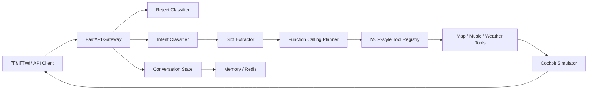

# 智能座舱任务型对话系统

面向课程设计、毕业设计和工程实践展示的智能座舱语义理解项目。系统支持语音指令解析、拒识、意图识别、槽位抽取、Function Calling 计划、MCP 风格工具注册、多轮状态管理、车机端模拟前端和端到端评测。

## 项目功能

- 车机测试前端：输入语音指令，实时查看车机状态变化和模块链路。
- 任务型语义解析：导航、音乐、天气、车辆控制、未知意图。
- 拒识二分类：过滤空输入、无意义输入、重复噪声和低价值请求。
- 意图识别：提供可解释 baseline，并提供 BERT/RoBERTa 微调训练脚本。
- 槽位抽取：将自然语言转换成结构化参数。
- Function Calling：生成函数名和参数，便于对接大模型工具调用。
- MCP 风格工具服务：注册地图、音乐、天气工具，统一调用入口。
- 多轮上下文：支持内存状态存储，部署时可切换 Redis。
- 端到端评测：提供样例评测接口和可扩展评测模块。
- AutoDL 部署：给出推荐服务器、镜像、端口和启动流程。

## 技术栈

- 后端：Python 3.9+、FastAPI、Pydantic、Uvicorn
- 前端：HTML、CSS、JavaScript
- 状态存储：In-Memory / Redis
- 模型训练：PyTorch、Transformers、Datasets
- 工具层：Function Calling Schema、MCP-style Registry
- 测试：Pytest、FastAPI TestClient

## 系统架构



## 目录结构

```text
vehicle-dialog-agent/
├── app/
│   ├── api/              # HTTP API
│   ├── cockpit/          # 车机状态模拟器
│   ├── dialogue/         # 对话编排和多轮状态
│   ├── evaluation/       # 端到端评测
│   ├── llm/              # Function Calling Schema
│   ├── mcp/              # MCP 风格工具注册
│   ├── nlu/              # 拒识、意图识别、槽位抽取
│   ├── static/           # 车机测试前端
│   └── tools/            # 地图、音乐、天气工具
├── docs/
│   ├── architecture.md
│   ├── autodl_deploy.md
│   └── evaluation.md
├── training/
│   ├── data/
│   └── scripts/
├── tests/
├── requirements.txt
└── requirements-train.txt
```

## 快速运行

```bash
python -m venv .venv
source .venv/bin/activate
pip install -r requirements.txt
uvicorn app.main:app --host 0.0.0.0 --port 8080 --reload
```

Windows PowerShell:

```powershell
python -m venv .venv
.\.venv\Scripts\Activate.ps1
pip install -r requirements.txt
uvicorn app.main:app --host 0.0.0.0 --port 8080 --reload
```

打开车机测试台：

```text
http://127.0.0.1:8080/
```

## 核心接口

健康检查：

```bash
curl http://127.0.0.1:8080/health
```

语义解析：

```bash
curl -X POST http://127.0.0.1:8080/v1/dialogue/parse \
  -H "Content-Type: application/json" \
  -d '{"query":"导航去北京南站","session_id":"demo"}'
```

车机模拟：

```bash
curl -X POST http://127.0.0.1:8080/v1/cockpit/apply \
  -H "Content-Type: application/json" \
  -d '{"query":"打开空调","session_id":"demo"}'
```

工具列表：

```bash
curl http://127.0.0.1:8080/v1/mcp/tools
```

样例评测：

```bash
curl http://127.0.0.1:8080/v1/evaluation/sample
```

## 模型训练

安装训练依赖：

```bash
pip install -r requirements-train.txt
```

在 AutoDL 上微调 BERT/RoBERTa 意图识别模型：

```bash
python training/scripts/train_transformer_classifier.py \
  --data training/data/intent_sample.jsonl \
  --model hfl/chinese-roberta-wwm-ext \
  --output outputs/intent-roberta \
  --epochs 3 \
  --batch-size 16
```

## AutoDL 推荐服务器

推荐配置：

| 项目 | 推荐值 |
| --- | --- |
| GPU | RTX 4090 / RTX 4090D，24GB 显存 |
| CPU | 8 vCPU 或以上 |
| 内存 | 32GB 起，推荐 64GB |
| 磁盘 | 80GB 起 |
| 镜像 | PyTorch 2.x + Python 3.10 + CUDA 11.8 |
| 用途 | BERT/RoBERTa 微调、FastAPI 服务、前端演示 |

详细部署步骤见 [docs/autodl_deploy.md](docs/autodl_deploy.md)。

## 测试

```bash
pytest
```

当前测试覆盖：

- 健康检查
- 前端首页
- 语义解析
- 拒识
- 车机状态更新

## 文档

- [系统架构](docs/architecture.md)
- [AutoDL 部署](docs/autodl_deploy.md)
- [评测方案](docs/evaluation.md)
